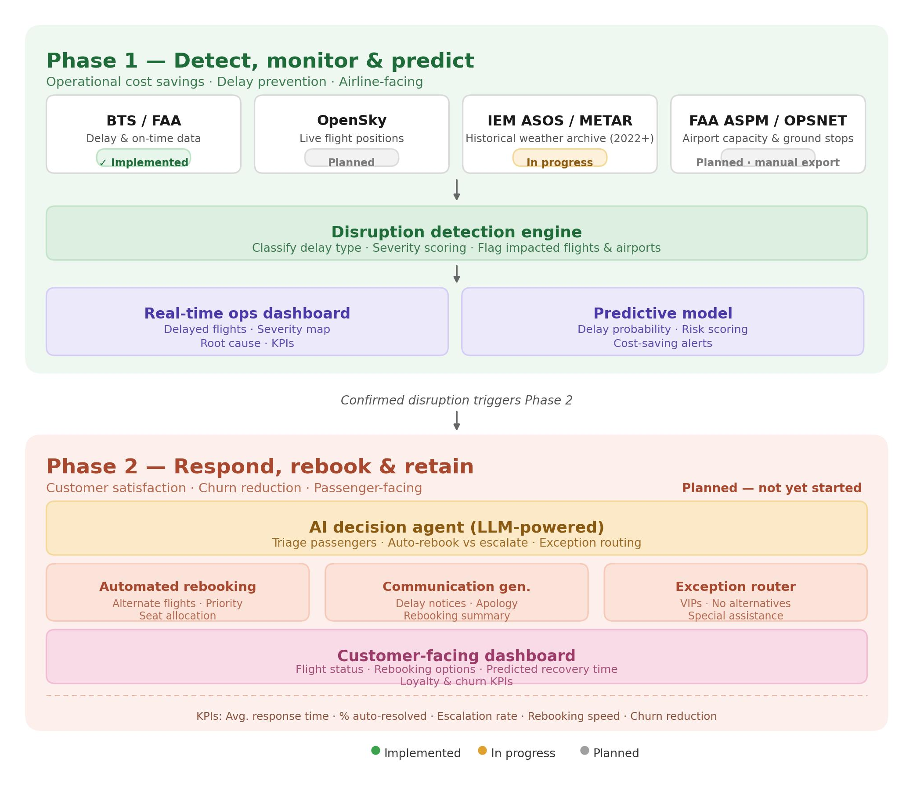

# AI-Powered Airline Disruption Detection & Recovery System

A faculty-mentored research project applying real public aviation data to build a two-phase system for detecting, predicting, and responding to airline flight disruptions.

**Status:** ✅ Phase 1 complete — started June 2026

## 🔗 Live Dashboards

- **[Operations Dashboard](https://deva2013.github.io/airline-disruption-management-system/phase1_dashboard.html)** — historical KPIs: delay rates by airport, severity breakdown, seasonal trends, hour × airport heatmap
- **[Predictive Risk Dashboard](https://deva2013.github.io/airline-disruption-management-system/phase1_predictive_risk_dashboard.html)** — model output: ROC-AUC, feature importance, flagging outcomes, actual vs. flagged risk by airport

## Overview

Most academic and industry work on airline disruption management relies on synthetic or simulated data. This project uses only real, publicly available datasets to build an end-to-end pipeline — from raw flight/weather data to a predictive model, live dashboards, and (in Phase 2) an AI-driven passenger communication workflow.

## Architecture

**Phase 1 — Detect, Monitor & Predict** ✅ Complete
- Ingests BTS On-Time Performance data (including aircraft tail number) and historical METAR weather data via the Iowa Environmental Mesonet (IEM) ASOS archive
- Scoped to flights departing from 10 major U.S. hub airports (5.9M+ flights, 2022–2024) — restricted to origin-hub departures so every flight has a genuine, verified weather match
- Disruption detection engine: classifies delay type and severity, cross-references airline-reported delay causes against independently measured weather conditions
- Feature engineering: airport-hour congestion, rolling airline/airport delay rate, and a novel aircraft-chain delay feature (prior-leg lateness by tail number)
- Predictive model: XGBoost, **0.72 ROC-AUC** on a held-out 2024 test set — the aircraft-chain feature is the single strongest predictor (37% of model importance), outweighing weather and schedule combined
- Two live dashboards (Plotly, published via GitHub Pages): an operations KPI dashboard and a predictive risk dashboard surfacing the model's actual output
- OpenSky flight-tracking data and FAA OPSNET airport-capacity/ground-stop data are planned enrichments — see [Data Sources](#data-sources) for current status of each

**Phase 2 — Respond, Rebook & Retain** (planned)
- LLM-powered decision agent for passenger triage and rebooking
- Automated, personalized delay communications
- Customer-facing dashboard with predicted recovery time

## Data Sources

| Source | Status | Notes |
|---|---|---|
| [BTS On-Time Performance Data](https://www.transtats.bts.gov/DL_SelectFields.aspx?gnoyr_VQ=FGJ) | ✅ Implemented | 10.5M+ flight records (touching 10 hub airports) cleaned and loaded via direct PREZIP download, including aircraft tail number |
| [IEM ASOS/METAR Archive](https://mesonet.agron.iastate.edu/request/download.phtml) | ✅ Implemented | True historical weather archive (2022+), hourly, no login required. Replaces NOAA's live Aviation Weather Data API, which only serves ~15 days of observations and cannot return historical data |
| [OpenSky Network](https://opensky-network.org/data) | 🔲 Planned | Live flight-position enrichment, not yet integrated |
| [FAA OPSNET / ASPM](https://www.aspm.faa.gov/opsnet/sys/Main.asp) | 🔲 Planned | No public API — data is exported manually per airport/date range via the OPSNET web reporting tool as daily, facility-level delay-by-cause figures, then joined in as a daily airport-level feature (not a per-flight join) |

## Model Results

| Iteration | Features added | ROC-AUC |
|---|---|---|
| Baseline | Schedule + weather | 0.6724 |
| + Congestion & rolling delay rate | Airport-hour congestion, prior-day delay rate | 0.6903 |
| + Aircraft-chain delay (final) | Prior-leg arrival delay by tail number | **0.7222** |

**Key finding:** the aircraft-chain feature (`PrevLegArrDelay`) — whether a specific aircraft's previous flight leg arrived late, and by how much — is the single largest driver of delay risk, far outweighing weather, congestion, or schedule timing. Continuous delay magnitude also meaningfully outperforms a simple binary "was it late" flag, indicating delay severity itself carries predictive signal that a threshold discards.

## Tech Stack
Python, Pandas, XGBoost, scikit-learn, Plotly, fastparquet, Google Colab, Hugging Face Hub (data storage)

## Current Dataset
5.9M+ flight records departing 10 major U.S. hub airports, Jan 2022 – Dec 2024

## Mentorship
This project is being developed under the mentorship of faculty advisors at the W. P. Carey School of Business, Arizona State University.

## Author
Devajith Indrajith Subramoniam — [LinkedIn](https://linkedin.com/in/devajithindrajith) | [Tableau Public](https://public.tableau.com/app/profile/devajith.indrajith.subramoniam)
